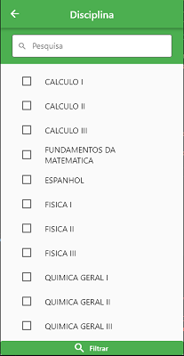
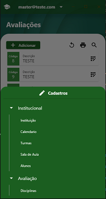

## Features

TODO: Publicar API backend para o exemplo 


## Imagens
+ **Tela de Login**


+ **Tela Inicial Desktop**


+ **Tela Inicial Mobile**


+ **Tela de Cadastro Desktop**


+ **Tela de Cadastro Mobile**


+ **Tela de Filtro**


+ **Tela de Filtro Selecionados**


+ **Menu Mobile**


+ **Tela de Perfis**


## Configurações Iniciais
Utilizamos o package **flutter_modular** para gerenciar os Modulos. Faça a configuração de acordo com a documentação do Flutter_Modular.
No main antes de iniciar  a classe "ModularApp", instancie a classe FlutterResponsive.
O package tambem utiliza o **bitsdojo_window**. Faça a configuração da pasta windows, linux, macos de acordo com a documentação para um melhor resultado nas versões para desktop.
# Parâmetros
+ **descricaosistema**: Nome do sistema. Localizado na tela de Login e no AppBar do Painel Principal.
+ **fundoLoginLateral**: Imagem que fica na lateral direita do Login.
+ **pathLogo**: Logo da Aplicação
+ **fundoLoginPrincipal**: Imagem de fundo que fica atras do Painel de login.
+ **infoSistema**: Breve descrição do sistema que esta localizado na lateral direita do login.
+ **menusExpandidos**: Lista de menus da classe "MenuExpandido". Menus que se adapta automaticamente a resolução da tela. 
Consulte a documentação na classe para parametraliza-la corretamente.


```dart
import 'package:flutter/material.dart';
import 'package:flutter_modular/flutter_modular.dart';
import 'package:flutter_responsive_template_template/flutter_responsive.dart';
import 'package:flutter_responsive_template_template/utils/telas/menus/menu.dart';
import 'package:flutter_responsive_template_template/utils/telas/menus/menu_espandido.dart';
import 'package:bitsdojo_window/bitsdojo_window.dart';
import 'package:flutter_responsive_template_template/constantes.dart';
import 'app/app_module.dart';
import 'app/app_widget.dart';

void main() {
  FlutterResposive(
    descricaosistema: "SIGA",
    fundoLoginLateral: "imagens/fundo_login.jpg",
    pathLogo: "imagens/avaliacao.png",
    fundoLoginPrincipal: "imagens/fundo2.jpg",
    infosistema: "Sistema de Avaliacao",
    menusexpandidos: [
      MenuExpandido(
        label: "Principal",
        indexMenu: 0,
        iconMobile: Icons.desktop_windows,
        menus: [
          Menu(
            label: "Home",
            icon: Icons.home,
            rota: "/home",
            mapeado: false,
          ),
        ],
      ),
    ],
  );
  runApp(
    ModularApp(
      module: AppModule(),
      child: AppWidget(),
    ),
  );
  if (isDesktop) {
    doWhenWindowReady(() {
      const initialSize = Size(900, 700);
      appWindow.minSize = Size(300, 500);
      appWindow.size = initialSize;
      appWindow.alignment = Alignment.center;
      appWindow.show();
    });
  }
}

```
# AppWidget
É possivel personalizar o thema do packge dentro do theme do AppWiget
```dart
import 'package:flutter/material.dart';
import 'package:flutter_modular/flutter_modular.dart';
import 'package:flutter_localizations/flutter_localizations.dart';

class AppWidget extends StatelessWidget {
  @override
  Widget build(BuildContext context) {
 return MaterialApp.router(
      title: 'Exemplo',
      debugShowCheckedModeBanner: false,
      theme: ThemeData(
        primaryColor: Colors.deepOrange,
        iconTheme: IconThemeData(color: Colors.white),
        dataTableTheme: DataTableThemeData(
          dividerThickness: 1,
          headingTextStyle: TextStyle(color: Colors.white),
          headingRowHeight: 30,
          headingRowColor: MaterialStatePropertyAll(
            Colors.deepOrange.withOpacity(0.8),
          ),
        ),
        checkboxTheme: CheckboxThemeData(
          checkColor: MaterialStatePropertyAll(Colors.blue),
        ),
        colorScheme: ColorScheme.light(
          primary: Colors.red,
          secondary: Colors.brown.shade900,
          onPrimary: Colors.white,
          onSecondary: Colors.white,
        ),
      ),
      routeInformationParser: Modular.routeInformationParser,
      routerDelegate: Modular.routerDelegate,
      localizationsDelegates: GlobalMaterialLocalizations.delegates,
      supportedLocales: [const Locale('pt', 'BR')],
    );
  }
}
  ```
# AppController
Crie uma classe que herda da Classe IAppController para ser usada como Bind do AppModule. 

```dart
import 'package:flutter_responsive_template_template/utils/module_base/app_controller.dart';

class AppController extends IAppController {}
```

# AppModule
Para um correto funcionamento do package é necessario que os seguintes modulos sejam instanciados no AppModule com o mesmo nome de rota.
Apenas o HomeModule é necessario Criar. Os outros modulos importe do package.
+ **Modular.initialRoute:**: LoginModule(). 
+ **/home**: HomeModule(). 
+ **/usuario**: UsuariosModule(). 
+ **/perfis**: PerfisModule()
+ **/filtrarusuario**: FiltroUsuario()
+ **/filtrardescricao**:FiltroDescricao()

```dart
import 'package:example/app/app_controller.dart';
import 'package:flutter_modular/flutter_modular.dart';
import 'package:flutter_responsive_template_template/app/modules/login/login_module.dart';
import 'package:flutter_responsive_template_template/app/modules/usuarios/usuarios_module.dart';
import 'package:flutter_responsive_template_template/app/modules/perfis/perfis_module.dart';
import 'package:flutter_responsive_template_template/utils/rotas/rota_modal.dart';
import 'package:flutter_responsive_template_template/utils/filtros/herdados/filtro_usuarios.dart';
import 'package:flutter_responsive_template_template/utils/filtros/herdados/filtro_descricao.dart';
import 'modules/home/home_module.dart';

class AppModule extends Module {
  @override
  final List<Bind> binds = [Bind.lazySingleton((i) => AppController())];

  @override
  final List<ModularRoute> routes = [
    ModuleRoute(
      Modular.initialRoute,
      module: LoginModule(),
      transition: TransitionType.noTransition,
    ),
    ModuleRoute(
      "/home",
      module: HomeModule(),
      transition: TransitionType.noTransition,
    ),
    ModuleRoute(
      "/usuario",
      module: UsuariosModule(),
      transition: TransitionType.fadeIn,
    ),
    ModuleRoute(
      "/perfis",
      module: PerfisModule(),
      transition: TransitionType.fadeIn,
    ),
    RotaModal(
      '/filtrarusuario',
      child: (_, args) => FiltroUsuario(),
    ),
    RotaModal('/filtrardescricao', child: (_, args) => FiltroDescricao())
  ];
}
```
# Padrão para herança das Pages e Stores Simples (Sem Datatables) 
+ As "Pages" devem herdar da classe TelaBase. É obrigatório indicar o seu Store (Herdado do StoreBase). Conforme o exemplo da HomePage abaixo. No caso de uma pagina simples, apenas use os parametros title e conteudo.

```dart
import 'package:example/app/modules/home/home_store.dart';
import 'package:flutter/material.dart';
import 'package:flutter_responsive_template/utils/telas/tela_base.dart';
class HomePage extends TelaBase<HomeStore> {
  HomePage()
      : super(
          title: "Home",
          conteudo: () {
            return Container();
          },
        );
}
```
+ Os "Stores" devem  herdar do StoreBase.

```dart
import 'package:flutter_responsive_template_template/utils/telas/store/store_base.dart';
import 'package:mobx/mobx.dart';

part 'home_store.g.dart';

class HomeStore = HomeStoreBase with _$HomeStore;

abstract class HomeStoreBase extends StoreBase with Store {}
```

# Padrão para herança das Pages, repository e Stores (Datatables) 
Para utilizar o datatable é necessario utilizar as sequintes estrutura de herença:
+ **Dados** : Classe de dados para o popular o datatable. Por padrao a classe gera colunas e linhas a partir dos campos "id", e "descricao" do json obtido da api. Para alterar o padrao gerado reescreva os metodos  "processarRow", e o get "colunas". O get card é chamado quando é identificado uma resolução de dispositivos pequenos. Por padrão é gerado um Card com os "id" e "descricao". Reescreva esse metodo caso deseja outras insformações. Ex.

```dart
import 'package:flutter_responsive_template_template/utils/telas/datatable/data.dart';
class Aluno extends Dados {}
```
+ **Repository** : Classe para conexao com a Api de dados. Esta classe ja implementa as operações de chamada de crud da api: (GetID, GetAll, delete, save (editar e incluir)).E necessário informar o endpoint da api. Ex.
```dart
class AlunoRepository extends Repository {
  AlunoRepository() : super("aluno");
}
```
+ **StoreBase** : Classe que controla as operações basicas do crud. O parametro dataType é uma classe que herda da Dados. Tambem é obrigatório informar o repository.
```dart
import 'package:escolas/app/model/aluno.dart';
import 'package:escolas/app/modules/aluno/aluno_repository.dart';
import 'package:flutter_responsive_template_template/utils/telas/store/store_base.dart';
import 'package:mobx/mobx.dart';

part 'aluno_store.g.dart';

class AlunoStore = _AlunoStoreBase with _$AlunoStore;

abstract class _AlunoStoreBase extends StoreBase with Store {
  _AlunoStoreBase() : super(datatype: Aluno(), repository: AlunoRepository());
}
```
+ **TelaDesktopBase** : Classe que modela a page principal. Utilize os parametros de Title e Filtros (opcional).
Obs.: Os filtros possui um padrao descrito na classe RotaFiltros. Leia os comentários contidos na classe para obter mais detalhes.
```dart
import 'package:escolas/app/modules/aluno/aluno_store.dart';
import 'package:flutter_responsive_template_template/utils/telas/partes_tela/rota_filtros.dart';
import 'package:flutter_responsive_template_template/utils/telas/tela_desktop.dart';

class AlunoPage extends TelaDesktopBase<AlunoStore> {
  AlunoPage()
      : super(title: "Manutenção de Aluno", 
      filtros: [
          RotaFiltros(label: "Descrição", rota: "filtrardescricao"),
          RotaFiltros(
              label: "Nascimento",
              rota: "filtrarnascimento",
          )
        ]
      );
}

```
# Padrão para herança das Pages, Repositorys e Stores (CRUD)
Crie um submodulo com o nome Crud e altere a classe de modulo principal conforme o exemplo abaixo:
Obs.: A rota do submodulo deve chamar "/crud"
```dart
import 'package:escolas/app/modules/aluno/crud/crud_module.dart';
import 'package:escolas/app/modules/aluno/aluno_page.dart';
import 'package:escolas/app/modules/aluno/aluno_store.dart';
import 'package:flutter_responsive_template_template/utils/filtros/bases/filtro_base.dart';
import 'package:flutter_responsive_template_template/utils/filtros/herdados/filtrar_data.dart';
import 'package:flutter_responsive_template_template/utils/rotas/rota_modal.dart';
import 'package:flutter_modular/flutter_modular.dart';

class AlunoModule extends Module {
  @override
  final List<Bind> binds = [
    Bind.lazySingleton((i) => AlunoStore()),
  ];

  @override
  final List<ModularRoute> routes = [
    //pagina principal
    ChildRoute('/', child: (_, args) => AlunoPage()),
    //submodulo crud
    ModuleRoute("/crud",
        module: CrudModule(), transition: TransitionType.noTransition),
  ];
}


```
+ **CrudStore**: Classe que controla a gravação e popular dados no crud. Obs.: Utilize o mesmo repository do modulo principal ou crie um especifico. 
```dart 
import 'package:escolas/app/modules/aluno/aluno_repository.dart';
import 'package:flutter_responsive_template_template/utils/telas/store/store_crud_base.dart';
import 'package:mobx/mobx.dart';

part 'crud_store.g.dart';

class CrudStore = _CrudStoreBase with _$CrudStore;

abstract class _CrudStoreBase extends StoreCrudBase with Store {
  _CrudStoreBase() : super(repository: AlunoRepository());
}

```
+ **FormGenerator**:Classe que gera um form. É necessario infomar o CrudBase que vai gerenciar este crud. Os inputs são classes que implementam a interface IInput (Input, InputComboBox, InputLookup, InputFoto, InputInline....). É possivel tambem usar Steps para criar um form. Utilize o parametro turples e deixe nulo o inputs.

```dart
import 'package:escolas/app/modules/aluno/crud/crud_store.dart';
import 'package:flutter_responsive_template/utils/telas/inputs/crud_base.dart';
import 'package:flutter_responsive_template/utils/telas/inputs/input.dart';

class CrudPage extends CrudBase<CrudStore> {
  CrudPage()
      : super(
            inputs: [
              Input(
                name: "id",
                label: "Id",
                isPrimaryKey: true,
              ),
              Input(
                  name: "descricao", label: "Nome do Aluno", obrigatorio: true),
              Input(
                  name: "nascimento",
                  label: "Data de Nascimento",
                  obrigatorio: true,
                  inputType: InputType.date),
            ],
            title: "Aluno",
            height: 600,
            width: 600,
          );
}

```
